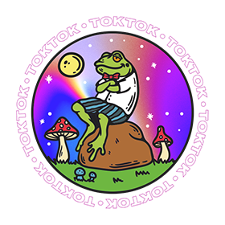

<p align="center">
    <br>
    Generic tokenizer written in Nim language, powered by Nim's Macros 👑
</p>

## 😍 Key Features
- [x] Support `char`, `string`, `int` based tokens
- [x] Powered by Nim's Macro
- [ ] Available as a Native NodeJS addon (soon)
- [x] Open Source | `MIT`

## Installing
```bash
nimble install toktok
```

## Quick Example

```nim
import toktok

tokens:
    Plus      > '+'
    Minus     > '-'
    Multi     > '*'
    Div       > '/'
    Integer   > '0'..'9'
    String    > 'a'..'z' & 'A'..'Z'

when isMainModule:
    var lex = Lexer.init(fileContents = readFile("sample.txt"))
    if lex.hasError:
        echo lex.getError
    else:
        while true:
            var curr = lex.getToken()
            if curr.kind == TK_EOF: break
            echo curr
```

## Based on Toktok
Here you can find some cool projects based on Toktok Lexer

### Tim Engine
⚡️ High-performance, compiled template engine inspired by Emmet syntax.

### Parrot
State of the Art 👌 JSON Content Rules Language, Validator and Generator

### Psydoc 
A module that generates PHP API documentation for Psypac. Check repository

## Roadmap
_to add roadmap_

### ❤ Contributions
If you like this project you can contribute to Toktok by opening new issues, fixing bugs, contribute with code, ideas and you can even [donate via PayPal address](https://www.paypal.com/donate/?hosted_button_id=RJK3ZTDWPL55C) 🥰

### 👑 Discover Nim language
<strong>What's Nim?</strong> Nim is a statically typed compiled systems programming language. It combines successful concepts from mature languages like Python, Ada and Modula. [Find out more about Nim language](https://nim-lang.org/)

<strong>Why Nim?</strong> Performance, fast compilation and C-like freedom. We want to keep code clean, readable, concise, and close to our intention. Also a very good language to learn in 2022.

### 🎩 License
Toktok is an Open Source Software released under `MIT` license. [Developed by Humans from OpenPeep](https://github.com/openpeep).<br>
Copyright &copy; 2022 OpenPeep & Contributors &mdash; All rights reserved.
